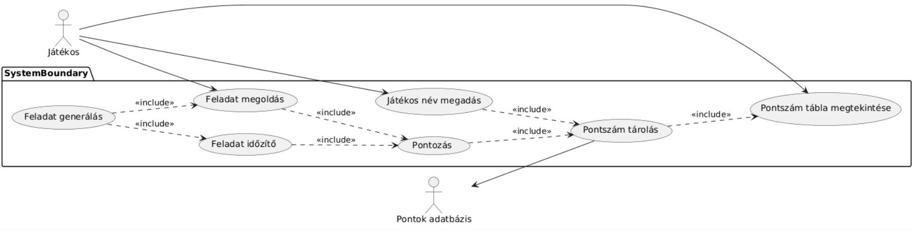

# Funkcionális specifikáció
## [Áttekíntés](./kovspec.md#Áttekíntés)

## [Követelménylista](./kovspec.md#Követelménylista)

## Használati esetek

## Megfeleltetés
|Használati Esetek|Követelmény ID|
|:----------------|:--------------|
|Játékos név megadás|K1, K2|
|Feladat generálás|K1, K4|
|Feladat időzítő|K1, K5|
|Feladat megoldás|K1|
|Pontozás|K6|
|Pontszám tárolás|K7|
|Pontszám tábla megtekintése|K3|

## Forgatókönyvek
- Játék indítása: a játékos megadja a nevét, rányom a start gombra.
- Feladat elkészítése: a játékos kap egy egyenletet, például 10*x=40. Meg kell adnia az x értéket az egyenlet alatti mezőbe, ezután vagy entert nyom vagy rányom a leadás gombra.
- Ponttábla megtekíntése: ponttábla gomb megnyomása
